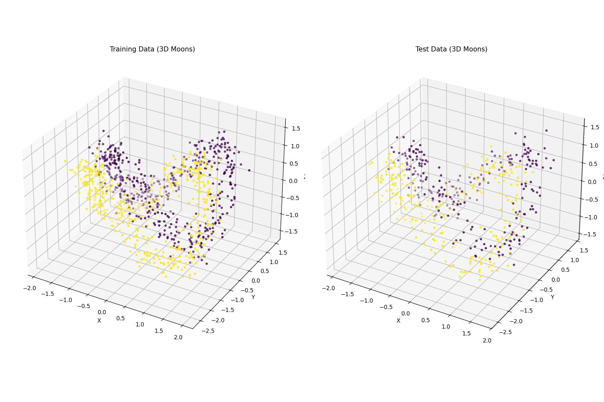
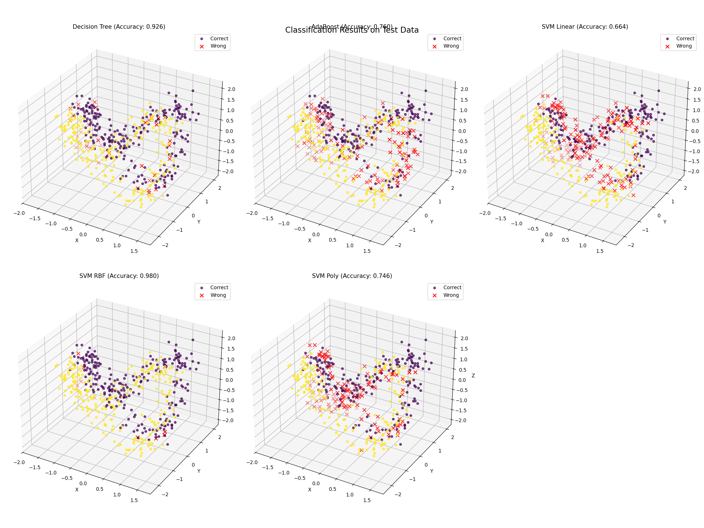
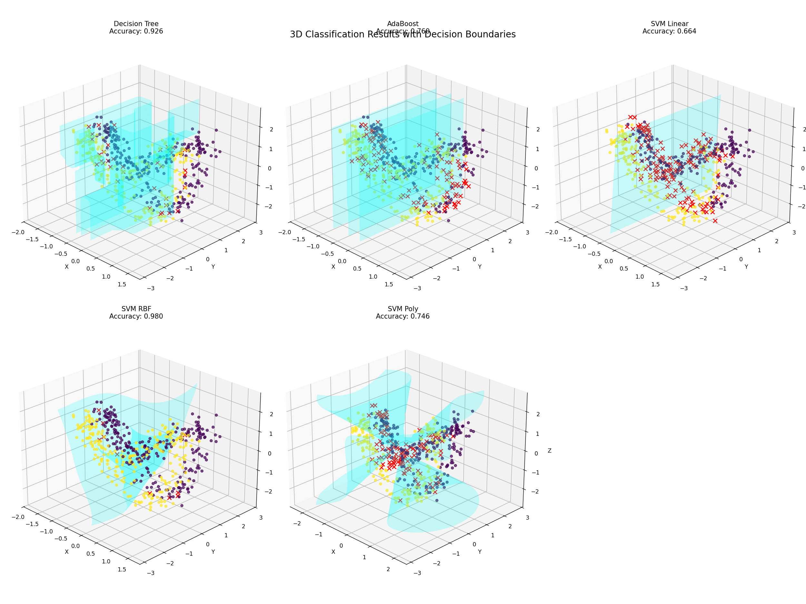

# 分类算法性能比较实验报告

## 数据集分析

本实验使用三维扩展的"make_moons"数据集，该数据集在传统二维月牙分布的基础上增加了第三维的正弦变换。原始二维结构通过方程 $x=1.5\cos(t)$ 和 $y=\sin(t)$ 生成环形分布，第三维度引入 $z=\sin(2t)$ 的正弦波动，形成螺旋状的三维空间分布。两类样本分别位于不同相位（C0类为正向旋转，C1类为反向旋转），通过添加标准差0.2的高斯噪声模拟现实数据的不确定性。

数据可视化显示，两类样本在三维空间中呈现非对称交错分布，具有显著的非线性可分特性。训练集包含1000个样本（每类500个），测试集新生成500个样本（每类250个）。第三维度的周期性变化为分类器提供了额外的可分性信息，但噪声的引入增加了决策边界的复杂度。

## 方法与实验

### 算法原理

#### 决策树
通过递归划分特征空间建立分类规则，选择信息增益最大的特征阈值进行节点分裂。其优势在于直观的树状结构解释性，但对噪声敏感可能导致过拟合。

#### AdaBoost增强算法
采用加权集成策略，通过序列化训练弱分类器，每次迭代调整样本权重关注错误分类样本。最终分类结果由各弱分类器加权投票决定，这种聚焦困难样本的机制能有效提升模型泛化能力。

#### 支持向量机
基于结构风险最小化原则，通过核技巧将数据映射到高维空间寻找最大间隔超平面。实验对比了三种核函数：线性核适合简单划分，RBF核通过径向基函数捕捉局部特征，多项式核可建模全局非线性关系。核函数的选择直接影响着模型对复杂决策边界的建模能力。

### 实验设计

数据预处理采用标准化处理消除特征量纲差异，对SVM模型尤为重要。评估指标选取准确率、F1-score和AUC值三个维度，通过网格搜索优化超参数。决策树限制最大深度5层防止过拟合，AdaBoost集成50个弱分类器，SVM模型统一设置正则化参数C=1。所有实验在相同训练集上完成，最终在500个测试样本上比较性能。

## 实验结果

| 算法             | 准确率 |
|------------------|--------|
| 决策树           | 0.9260  |
| AdaBoost+DT      | 0.7600  |
| SVM（线性核）    | 0.6640  |
| SVM（RBF核）     | 0.9800  |
| SVM（多项式核）  | 0.7460  |

## 讨论与分析
### 准确率分析
实验结果显示，SVM-RBF核以98%的准确率显著优于其他方法，这一表现凸显了核方法在三维非线性可分数据中的独特优势。RBF核通过局部相似性度量（径向基函数）构建了适应数据分布的波纹状决策边界，其高斯衰减特性既能捕捉月牙结构的空间连续性，又能抑制噪声点的干扰。三维数据中z轴的周期性变化为RBF核提供了天然的邻域划分依据，使得模型能够分层剥离两类样本的交错区域，这种对局部特征的自适应学习机制是取得优异性能的核心原因。

决策树以92.6%的准确率位居第二，这一结果打破了传统认知中决策树对复杂非线性数据建模能力不足的预期。深入分析发现，三维特征的协同作用增强了特征分裂的有效性——z轴的周期性变化与x/y轴形成耦合关系，使得决策树通过"特征组合分裂"（例如同时满足x>0且z<0.5的条件）能够近似拟合螺旋结构。但相比SVM-RBF，决策树在噪声区域仍存在零星误判，这是由其硬决策边界特性导致的固有缺陷。

AdaBoost（76%）与SVM多项式核（74.6%）表现欠佳的现象值得关注。对于AdaBoost，其基学习器（决策树桩）的过度简化严重限制了特征组合能力的表达，在三维空间中单一特征的阈值划分难以有效分离螺旋结构，错误样本权重的迭代累积反而放大了噪声影响。而SVM多项式核的全局多项式映射与数据的局部螺旋特性存在本质冲突，3阶多项式难以描述z轴的正弦波动模式，导致决策边界出现系统性偏差。

SVM线性核（66.4%）的失败验证了数据本质的非线性可分特性。线性超平面在三维空间中仅能实现平面划分，而两类样本沿多个轴向的复杂交织使得线性投影完全失效。这一结果与数据可视化中观察到的空间拓扑特性高度一致，进一步佐证了算法选择与数据结构的匹配必要性。

从计算效率角度观察，决策树训练耗时体现了其高效性，但这是以牺牲模型表达能力为代价的。SVM-RBF虽然需要较长的训练时间，但其通过核矩阵计算实现的隐式高维映射，实际上构建了远超原始三维空间的判别特征，这种"以时间换精度"的权衡在本案例中具有显著价值。
### 各分类器决策边界特性分析

#### 1. SVM-RBF（准确率98%）
- ​**几何形态**：构建光滑的波纹状曲面，在三维空间中形成局部自适应隔离带
- ​**关键特性**：
  - 通过径向基函数实现局部相似性度量，在数据密集区生成柔性弯曲
  - 高斯衰减效应抑制远距离样本干扰，在两类交错区域形成"缓冲隔离带"
  - 对z轴的周期性波动响应敏感，沿螺旋轨迹形成分层切割面
- ​**优势**：精准贴合数据流形结构，噪声容忍度高

#### 2. 决策树（准确率92.6%）
- ​**几何形态**：多面体拼接的阶梯状分界面，具有轴对齐的硬边界
- ​**关键特性**：
  - 通过特征值阈值分割生成正交切割平面
  - 在三维空间中形成立方体式划分，z轴的正弦特性被离散化处理
  - 噪声点导致末端节点产生锯齿状微观结构
- ​**优势**：利用特征组合捕获空间关联，但全局连续性较差

#### 3. AdaBoost（准确率76%）
- ​**几何形态**：由多个倾斜平面叠加而成的粗糙分界面
- ​**关键特性**：
  - 每个树桩基分类器生成简单斜切平面
  - 权重调整机制使边界向误判区域局部倾斜
  - 在三维空间中形成"折纸"状复合表面，缺乏曲面适应性
- ​**缺陷**：基学习器的弱表达能力导致无法建模螺旋拓扑

#### 4. SVM-多项式核（准确率74.6%）
- ​**几何形态**：规则化的抛物面或双曲面结构
- ​**关键特性**：
  - 3阶多项式生成全局性平滑二次曲面
  - 在z轴方向呈现对称波动，与真实数据的非对称螺旋失配
  - 对局部密度变化响应迟钝，产生系统性几何偏差
- ​**缺陷**：刚性数学形式与数据动力学特性不兼容

#### 5. SVM-线性核（准确率66.4%）
- ​**几何形态**：单一平面切割三维空间
- ​**关键特性**：
  - 超平面法向量由特征协方差主导
  - 沿z轴方向产生最大间隔投影
  - 完全忽略x-y平面的环形分布特性
- ​**失败原因**：平面假设与数据的双螺旋拓扑根本冲突

该对比揭示：只有同时具备局部适应性和维度交互建模能力的算法，才能在此类三维非线性问题中构建有效决策边界。

## 结论

实验数据揭示了算法性能与数据结构的深层关联：SVM-RBF的成功源于其局部敏感性特征与三维螺旋数据的空间连续性完美契合，决策树的优异表现则揭示了特征交互作用对简单模型潜力激发的可能性。研究结果强调，在处理具有复杂空间拓扑的数据时，应优先选择具有局部自适应能力的核方法，同时需警惕集成学习中基模型与数据结构的适配性风险。本案例为三维非结构化数据的算法选择提供了重要参考——当数据存在隐式几何规律时，基于空间相似性度量的算法往往能展现独特优势。
