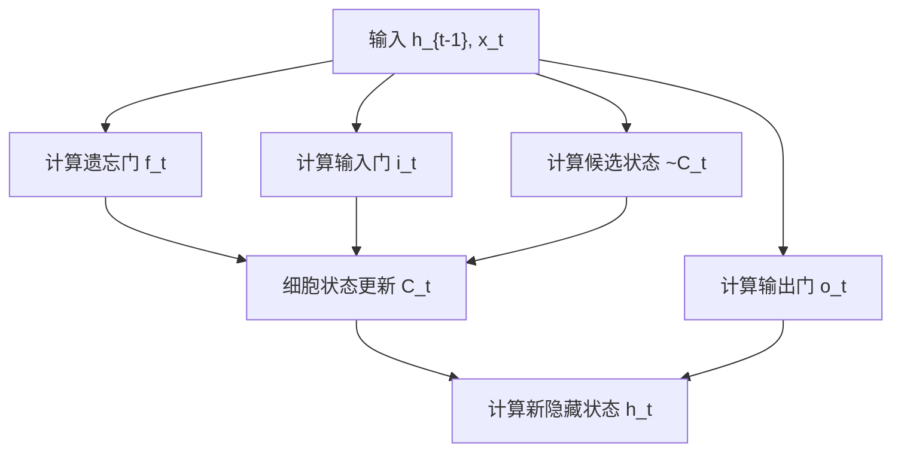
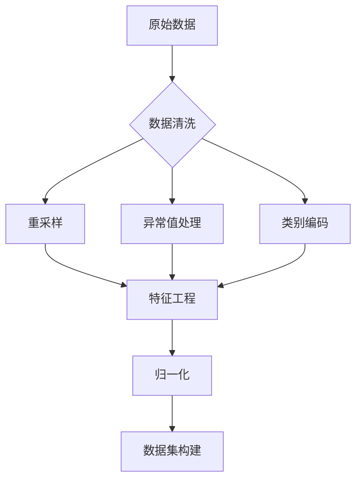
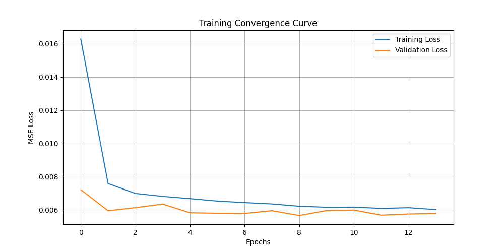
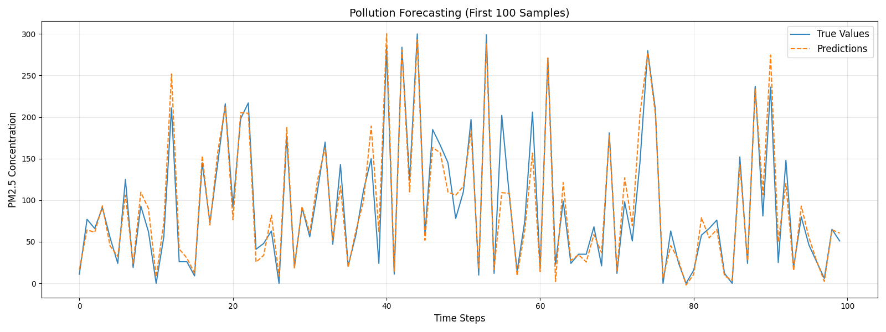

# 基于LSTM的污染浓度预测实验报告

## 1. 问题描述

针对空气质量监测场景，建立多变量时间序列预测模型，使用历史气象数据（温度、湿度、风速等）和污染物浓度数据，预测未来1小时的PM2.5浓度值。主要挑战包括：

- 时间序列的长期依赖建模
- 多变量特征间的复杂关系捕捉
- 数据中的噪声和缺失值处理

## 2. 概要

本实验构建了双层LSTM神经网络模型，使用过去24小时的8维特征数据（包含气象指标和历史浓度值），预测未来1小时的PM2.5浓度，预测效果良好。

## 3. LSTM结构原理

### LSTM 数学公式

#### 核心组件公式

##### 1. 遗忘门 (Forget Gate)

$$
f_t = \sigma(W_f \cdot [h_{t-1}, x_t] + b_f)
$$

##### 2. 输入门 (Input Gate)

$$
i_t = \sigma(W_i \cdot [h_{t-1}, x_t] + b_i)
$$

##### 3. 候选细胞状态 (Candidate Cell State)

$$
\tilde{C}_t = \tanh(W_C \cdot [h_{t-1}, x_t] + b_C)
$$

##### 4. 细胞状态更新 (Cell State Update)

$$
C_t = f_t \odot C_{t-1} + i_t \odot \tilde{C}_t
$$

##### 5. 输出门 (Output Gate)

$$
o_t = \sigma(W_o \cdot [h_{t-1}, x_t] + b_o)
$$

##### 6. 隐藏状态输出 (Hidden State Update)

$$
h_t = o_t \odot \tanh(C_t)
$$

#### 符号说明


| 符号      | 描述                          | 维度                              |
| --------- | ----------------------------- | --------------------------------- |
| $x_t$     | 当前时间步输入向量            | $(d_{in},)$                       |
| $h_{t-1}$ | 前一时间步隐藏状态            | $(d_{hidden},)$                   |
| $C_{t-1}$ | 前一时间步细胞状态            | $(d_{hidden},)$                   |
| $W_*$     | 权重矩阵 (f,i,C,o 对应不同门) | $(d_{hidden}, d_{in}+d_{hidden})$ |
| $b_*$     | 偏置项                        | $(d_{hidden},)$                   |
| $\sigma$  | Sigmoid 激活函数              | $\sigma(x) = \frac{1}{1+e^{-x}}$  |
| $\odot$   | Hadamard 积 (逐元素相乘)      |                                   |

#### 公式流程说明



## 4. 实验配置

### 4.1 模型参数


| 参数层   | 配置说明                | 参数值    |
| -------- | ----------------------- | --------- |
| 输入层   | 时间步长 × 特征维度    | 24×13    |
| LSTM1    | 隐藏单元数 + Return Seq | 64 + True |
| Dropout1 | 随机失活率              | 0.2       |
| LSTM2    | 隐藏单元数              | 64        |
| Dropout2 | 随机失活率              | 0.2       |
| 输出层   | 全连接层                | 1 neuron  |

### 4.2 训练参数

```python
{
    "optimizer": "Adam",
    "learning_rate": 0.001,
    "batch_size": 72,
    "epochs": 100,
    "early_stop": {
        "monitor": "val_loss",
        "patience": 5
    },
    "loss": "MSE"
}
```

## 5. 实验过程

### 5.1 数据预处理




#### 数据处理过程说明

##### **数据清洗**

1. **重采样处理**

   - 按小时频率对原始数据进行重采样，使用线性插值填充缺失值，确保时间序列连续。
2. **异常值处理**

   - 对污染浓度（`pollution`列）设置硬性阈值，超过300的值直接截断为300。
3. **类别编码**

   - 将风向（`wnd_dir`）列转换为数值型分类编码（0到N的整数）。

##### **特征工程**

1. **时间特征构造**

   - 提取当前时间的小时数值（`hour`列）。
   - 通过余弦函数生成周期性时间编码（`day_cos`列）。
2. **滞后特征生成**

   - 创建污染浓度的滞后1小时、2小时、3小时历史值（`pollution_lag1`、`pollution_lag2`、`pollution_lag3`）。

##### **归一化**

- 使用`MinMaxScaler`对所有特征和目标列进行全局归一化，将数据线性缩放到[0,1]区间。

##### **数据集构建**

1. **滑动窗口划分**

   - 以连续24小时的多维特征作为输入窗口，下一时刻的污染浓度作为输出标签。
2. **数据分割**

   - 将完整数据集按8:2比例随机划分为训练集和测试集，未保留时间顺序。

### 5.2 结果评估指标

**指标计算公式：**

- 平均绝对误差（MAE）

$$
\text{MAE} = \frac{1}{n} \sum_{i=1}^{n} |y_{\text{true}}^{(i)} - y_{\text{pred}}^{(i)}|
$$

- 均方根误差（RMSE）

$$
\text{RMSE} = \sqrt{\frac{1}{n} \sum_{i=1}^{n} \left(y_{\text{true}}^{(i)} - y_{\text{pred}}^{(i)}\right)^2}
$$

- 决定系数（R²）

$$
R^2 = 1 - \frac{\sum_{i=1}^{n} \left(y_{\text{true}}^{(i)} - y_{\text{pred}}^{(i)}\right)^2}{\sum_{i=1}^{n} \left(y_{\text{true}}^{(i)} - \bar{y}_{\text{true}}\right)^2}
$$

**指标特点**：

- MAE: 对异常值不敏感，反映平均绝对误差
- RMSE: 放大较大误差的影响，单位与原始数据一致
- R²: 取值区间为 $(-\infty, 1]$ ，越接近1说明模型解释力越强

## 6. 实验结果

### 6.1 训练过程曲线



**关键观察点：**

- 第14 epoch触发早停机制
- 验证损失稳定在0.0055-0.006区间
- 无明显过拟合现象

### 6.2 预测结果可视化



### 6.3 性能指标（归一化后）

MAE: 0.04

RMSE: 0.08

R² Score: 0.92

## 7. 实验结果分析

### **模型有效性**

R²达到0.92，表明模型能解释92%的污染浓度变化

### **误差来源**

- 极端天气事件（如沙尘暴）未包含在特征中
- 节假日交通模式变化未显式建模

### **改进方向**

- 添加空气质量指数(AQI)分级特征
- 尝试注意力机制+BiLSTM架构
