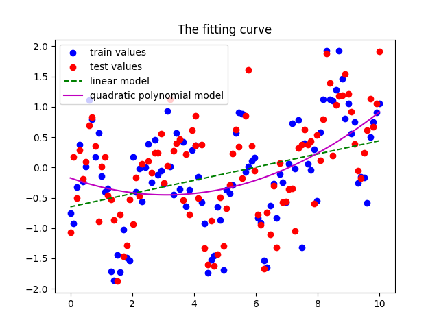
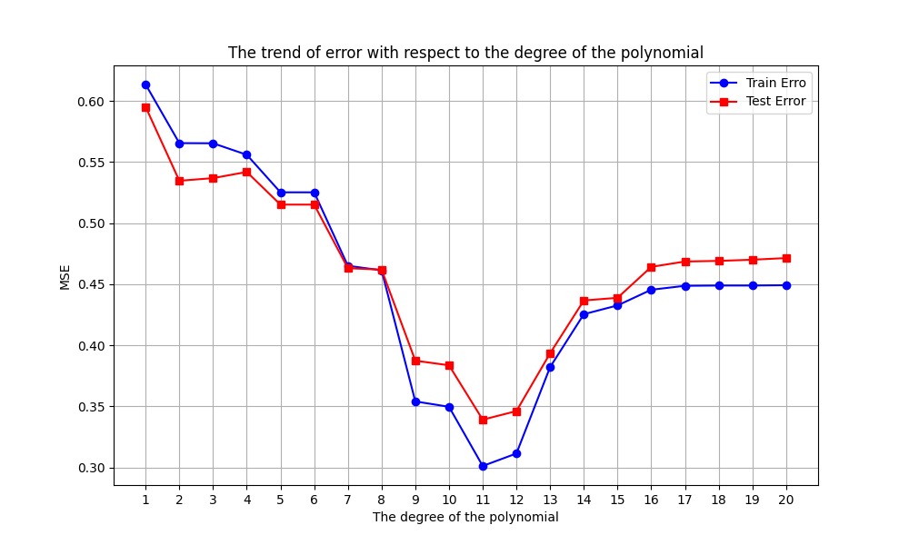
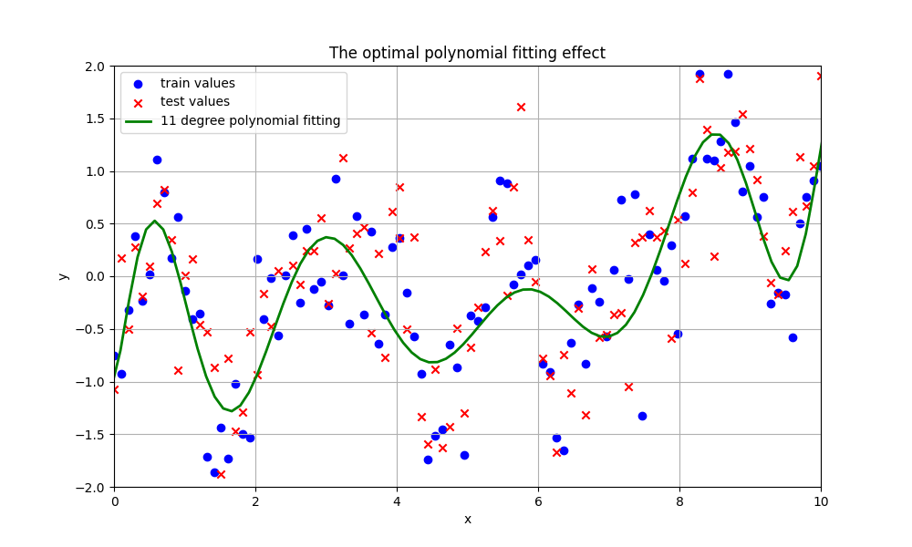

# 线性回归三种优化算法原理

## 1. 最小二乘法（Ordinary Least Squares, OLS）

### 原理公式
通过最小化**残差平方和（RSS）​**求解参数：

$$ J(\theta) = \frac{1}{2m} \sum_{i=1}^m (h_\theta(x^{(i)}) - y^{(i)})^2 $$

其中假设函数为线性组合：

$$ h_\theta(x) = \theta_0 + \theta_1x = \theta^T X $$

闭式解（正规方程）：

$$ \theta = (X^T X)^{-1} X^T y $$

### 核心步骤
1. 构造设计矩阵 $X$ （含偏置项 $x_0=1$ ）
2. 计算 $X^T X$ 的逆矩阵
3. 矩阵相乘求解参数 $\theta$ 

### 特点
- ✅ 直接解析解，无需迭代  
- ❌ 计算复杂度 $O(n^3)$ ，不适合高维数据  
- ❌ 矩阵不可逆时需增加正则化项  

---

## 2. 梯度下降法（Gradient Descent, GD）

### 原理公式
沿**负梯度方向**迭代更新参数：  
损失函数（均方误差）：

$$ J(\theta) = \frac{1}{2m} \sum_{i=1}^m (h_\theta(x^{(i)}) - y^{(i)})^2 $$

参数更新公式：

$$ \theta_j := \theta_j - \alpha \frac{\partial J(\theta)}{\partial \theta_j} $$

展开式为：

$$ \theta_j := \theta_j - \frac{\alpha}{m} \sum_{i=1}^m (h_\theta(x^{(i)}) - y^{(i)})x_j^{(i)} $$

矩阵形式批量更新：

$$ \theta := \theta - \frac{\alpha}{m} X^T (X\theta - y) $$

### 核心步骤
1. 初始化参数 $\theta$ 和学习率 $\alpha$
2. 循环计算梯度并更新参数直至收敛
3. 判定收敛条件（如误差变化<阈值）

### 特点
- ✅ 适用于大规模数据  
- ❌ 需手动设置学习率 $\alpha$  
- ❌ 可能陷入局部最优（凸函数可避免）  

---

## 3. 牛顿法（Newton's Method）

### 原理公式
利用**Hessian矩阵**加速收敛的二阶优化方法：  
损失函数的二阶泰勒展开：

$$ J(\theta) \approx J(\theta^{(t)}) + \nabla J(\theta^{(t)})^T (\theta - \theta^{(t)}) + \frac{1}{2} (\theta - \theta^{(t)})^T H(\theta^{(t)}) (\theta - \theta^{(t)}) $$

参数更新公式：

$$ \theta^{(t+1)} = \theta^{(t)} - H^{-1}(\theta^{(t)}) \nabla J(\theta^{(t)}) $$

对于线性回归问题，Hessian矩阵为：

$$ H = \frac{1}{m} X^T X $$

最终闭式解与OLS一致：

$$ \theta = (X^T X)^{-1} X^T y $$

### 核心步骤
1. 计算梯度 $\nabla J(\theta)$ 和Hessian矩阵 $H$
2. 求解线性方程组 $H\Delta\theta = -\nabla J(\theta)$
3. 更新参数 $\theta := \theta + \Delta\theta$

### 特点
- ✅ 二次收敛速度，迭代次数少  
- ❌ 需计算并存储Hessian矩阵（ $O(n^2)$ 内存）  
- ❌ 矩阵病态时数值不稳定  

---

## 算法对比
| 维度           | 最小二乘法          | 梯度下降法          | 牛顿法              |
|----------------|---------------------|---------------------|---------------------|
| ​**收敛速度**   | 一次计算            | 线性收敛            | 二次收敛            |
| ​**内存消耗**   | $O(n^2)$            | $O(n)$              | $O(n^2)$            |
| ​**适用场景**   | 小规模数据（n<1e4） | 大规模数据          | 中规模数据          |
| ​**实现难度**   | 低                  | 中                  | 高                  |
# 线性拟合结果

最小二乘法：

训练误差：0.6134, 测试误差：0.5950

梯度下降法：

训练误差：0.6134, 测试误差：0.5950

牛顿法：

训练误差：0.6134, 测试误差：0.5950

三种方法相差无几，训练集和测试集误差均较大。

# 多项式回归原理

## 1. 基本概念
多项式回归（Polynomial Regression）是线性回归的扩展形式，通过引入特征的**高次项**实现对非线性关系的建模。其核心思想是：
> 用多项式函数逼近未知的复杂关系，将非线性问题转化为线性问题处理

---

## 2. 数学模型

### 2.1 多项式假设函数
假设目标变量与特征的关系满足d次多项式：

$$
y = \theta_0 + \theta_1x + \theta_2x^2 + \cdots + \theta_dx^d + \epsilon
$$

其中：

 $ d $ : 多项式次数（Degree）
 
 $ \theta = [\theta_0, \theta_1, ..., \theta_d]^T $ : 待求参数向量
 
 $ \epsilon $ : 随机误差项

### 2.2 矩阵表示
将m个样本表示为矩阵形式：

$$
\boldsymbol{y} = \boldsymbol{X}\boldsymbol{\theta} + \boldsymbol{\epsilon}
$$

设计矩阵（Design Matrix）构造为：

$$
\boldsymbol{X} = \begin{bmatrix}
1 & x_1 & x_1^2 & \cdots & x_1^d \\
1 & x_2 & x_2^2 & \cdots & x_2^d \\
\vdots & \vdots & \vdots & \ddots & \vdots \\
1 & x_m & x_m^2 & \cdots & x_m^d
\end{bmatrix}_{m\times(d+1)}
$$

---

## 3. 参数估计方法

### 3.1 最小二乘法（OLS）
最小化残差平方和：

$$
\min_{\theta} J(\theta) = \frac{1}{2m}\sum_{i=1}^m (h_\theta(x^{(i)}) - y^{(i)})^2
$$

闭式解（正规方程）：

$$
\boldsymbol{\theta} = (\boldsymbol{X}^T\boldsymbol{X})^{-1}\boldsymbol{X}^T\boldsymbol{y}
$$

### 3.2 梯度下降法
迭代更新参数：

$$
\theta_j := \theta_j - \alpha\frac{\partial J}{\partial \theta_j} \quad (j=0,1,...,d)
$$

偏导数计算：

$$
\frac{\partial J}{\partial \theta_j} = \frac{1}{m}\sum_{i=1}^m (h_\theta(x^{(i)}) - y^{(i)})x^{(i)j}
$$

矩阵形式更新：

$$
\boldsymbol{\theta} := \boldsymbol{\theta} - \frac{\alpha}{m}\boldsymbol{X}^T(\boldsymbol{X}\boldsymbol{\theta} - \boldsymbol{y})
$$

---
# 多项式拟合结果

=== 不同多项式次数误差对比 ===

Degree 1: Train Error = 0.6134, Test Error = 0.5950

Degree 2: Train Error = 0.5654, Test Error = 0.5346

Degree 3: Train Error = 0.5653, Test Error = 0.5368

Degree 4: Train Error = 0.5559, Test Error = 0.5418

Degree 5: Train Error = 0.5252, Test Error = 0.5151

Degree 6: Train Error = 0.5252, Test Error = 0.5151

Degree 7: Train Error = 0.4651, Test Error = 0.4631

Degree 8: Train Error = 0.4614, Test Error = 0.4620

Degree 9: Train Error = 0.3541, Test Error = 0.3875

Degree 10: Train Error = 0.3497, Test Error = 0.3837

Degree 11: Train Error = 0.3013, Test Error = 0.3392

Degree 12: Train Error = 0.3115, Test Error = 0.3462

Degree 13: Train Error = 0.3822, Test Error = 0.3935

Degree 14: Train Error = 0.4255, Test Error = 0.4367

Degree 15: Train Error = 0.4327, Test Error = 0.4389

Degree 16: Train Error = 0.4455, Test Error = 0.4642

Degree 17: Train Error = 0.4487, Test Error = 0.4686

Degree 18: Train Error = 0.4489, Test Error = 0.4691

Degree 19: Train Error = 0.4489, Test Error = 0.4700

Degree 20: Train Error = 0.4492, Test Error = 0.4714

最佳多项式次数：11次

对应测试误差：0.3392

随多项式次数升高，训练误差和测试误差均先减小后增大，最佳多项式次数为11次，测试误差达到0.3392
